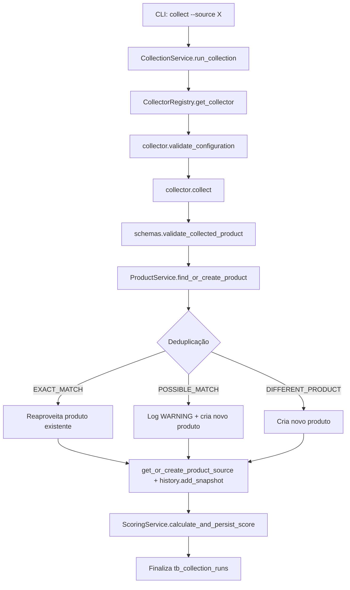

# Arquitetura

Este documento descreve a arquitetura interna do **Ninho & Mimo Trends**,
as camadas do sistema, o fluxo de dados ponta a ponta e as decisões de
design que se desviam (ou complementam) a especificação original.

## Visão geral em camadas

O projeto segue uma arquitetura em camadas simples, sem framework web,
orientada a um único processo CLI que fala diretamente com o PostgreSQL:

```
┌─────────────────────────────────────────────────────────────────┐
│ cli/                 parser.py (argparse) + handlers.py         │
│                      (dispatch, mapeamento exceção -> exit code) │
├─────────────────────────────────────────────────────────────────┤
│ cli/commands/        funções finas, uma por comando/subcomando   │
│                      (abrem UnitOfWork, chamam business/)        │
├─────────────────────────────────────────────────────────────────┤
│ business/            regras de negócio e orquestração:           │
│                      CollectionService, ProductService,          │
│                      ScoringService, TrendService,               │
│                      ModerationService, ExportService,           │
│                      safety_service (função pura)                │
├─────────────────────────────────────────────────────────────────┤
│ collectors/          BaseCollector, MockCollector,               │
│                      PublicSourceCollector, CollectorRegistry     │
├─────────────────────────────────────────────────────────────────┤
│ deduplication/       normalizer.py, product_matcher.py            │
│ scoring/             trend_score, social_score, risk_score,       │
│                      opportunity_score, score_calculator          │
│ schemas/             validação Pydantic (fronteira externa)       │
├─────────────────────────────────────────────────────────────────┤
│ repositories/         acesso a dados por agregado                │
│ database/             engine, session, UnitOfWork, healthcheck    │
│ models/               SQLAlchemy 2.0 (Mapped/mapped_column)        │
├─────────────────────────────────────────────────────────────────┤
│ configuration/        Settings (pydantic-settings) + json_loader  │
│ logging_config/       logging estruturado                        │
│ utils/                text, hashing, money, dates, retry          │
└─────────────────────────────────────────────────────────────────┘
```

Regra de dependência: cada camada só conhece as camadas abaixo dela.
`business/` nunca importa `cli/`; `repositories/` nunca importa
`business/`; `scoring/` e `deduplication/` são módulos puros (sem
acesso a banco), o que os torna fáceis de testar isoladamente.

## Fluxo de coleta ponta a ponta



Erros em um único item (categoria desconhecida, dado inválido) são
capturados, contados e registrados em `tb_collection_errors`, mas **não**
interrompem a execução. Somente uma falha da fonte como um todo
(`SourceUnavailableError`/`CollectorConfigurationError` levantada pelo
próprio coletor) interrompe a coleta e marca a execução como `FAILED`.

## Modo `--dry-run`

Em `collect --dry-run`, todo o pipeline de validação/normalização é
executado normalmente (para reportar quantos itens seriam criados,
atualizados ou ignorados), mas a transação é revertida (`rollback`) ao
final, e nenhum `CollectionRun` é persistido. Isso permite validar uma
fonte nova sem qualquer efeito colateral no banco.

## Decisões de design e desvios documentados

Estas decisões foram tomadas durante a implementação e se desviam ou
complementam a árvore de diretórios/especificação original. Cada uma foi
avaliada como necessária para manter o sistema coeso e testável.

1. **`AgeRangeRepository` adicional.** A especificação original não listava
   um repositório dedicado para faixas etárias, mas ele foi adicionado
   para manter o princípio de responsabilidade única (cada agregado tem
   seu próprio repositório), evitando lógica de faixa etária espalhada
   dentro de `ProductRepository`.

2. **Enum `MatchType` adicional.** Criado em `enums/match_type.py` para
   representar o resultado da deduplicação (`EXACT_MATCH`,
   `POSSIBLE_MATCH`, `DIFFERENT_PRODUCT`) de forma explícita e testável,
   em vez de usar strings soltas.

3. **`opportunity_score.py` separado de `score_calculator.py`.** Cada
   fórmula de pontuação (trend/social/risk/opportunity) vive em seu
   próprio módulo dentro de `scoring/`; `score_calculator.py` apenas
   orquestra a chamada às quatro funções e monta o resultado agregado
   (`ProductScoringResult`). Isso simplifica os testes unitários de cada
   fórmula isoladamente.

4. **`classify_risk_level` tornado público.** A lógica de classificar um
   valor numérico de risco em `RiskLevel` (LOW/MEDIUM/HIGH/CRITICAL)
   existia originalmente apenas dentro de `risk_score.py`. Foi promovida
   a função pública (`ninho_mimo_trends.scoring.risk_score.classify_risk_level`)
   porque `moderation_service.py` e `export_service.py` também precisam
   classificar um `risk_score` já persistido, sem duplicar a tabela de
   thresholds.

5. **`POSSIBLE_MATCH` tratado apenas via log, sem tabela de revisão.**
   Quando a deduplicação encontra um produto com similaridade "possível"
   (mas não exata) para o mesmo hash canônico, o sistema **não** faz
   merge automático (para não arriscar unir dois produtos diferentes) e
   **não** possui uma tabela dedicada de "revisão futura" no schema. Em
   vez disso, um novo produto é criado normalmente e um
   `logger.warning("POSSIBLE_MATCH_REVIEW_NEEDED: ...")` é emitido com o
   id do produto candidato, para que um humano possa revisar os logs e
   decidir manualmente. Esta é uma simplificação deliberada do MVP;
   uma tabela `tb_product_match_candidates` é sugerida no
   [roadmap](roadmap.md) para uma versão futura.

6. **Aprovação manual de produtos de risco HIGH/CRITICAL não é bloqueada.**
   `ModerationService.approve()` permite aprovar manualmente um produto
   mesmo que seu `risk_score` mais recente seja classificado como HIGH ou
   CRITICAL — a única restrição do MVP é contra **aprovação automática**
   de produtos de risco. Nesses casos, um `logger.warning(...)` é sempre
   emitido reforçando que uma revisão humana cuidadosa é recomendada,
   mas a decisão final permanece com quem opera a CLI.

7. **`safety_service.generate_safety_alerts` existe, mas não está
   conectado ao fluxo de coleta.** A função foi implementada como
   utilitário puro (sem I/O) que gera códigos de alerta (ex.:
   `REQUER_VERIFICACAO_INMETRO`, `RISCO_DE_ENGASGO`) a partir de
   categoria/texto/faixa etária/risco. Ela é testada isoladamente
   (`tests/unit/test_safety_service.py`), mas **ainda não é chamada** por
   `CollectionService` nem persistida em nenhuma tabela — não há coluna
   ou tabela no schema atual para armazenar esses alertas. Conectar esse
   serviço ao pipeline de coleta (e decidir onde persistir os alertas) é
   um próximo passo recomendado, descrito no [roadmap](roadmap.md).

## Unit of Work

`database/unit_of_work.py` implementa o padrão Unit of Work: um único
`UnitOfWork` abre uma sessão SQLAlchemy e expõe todos os repositórios já
vinculados a ela (`uow.products`, `uow.sources`, `uow.categories`,
`uow.age_ranges`, `uow.history`, `uow.scores`, `uow.collection_runs`,
`uow.collection_errors`). Cada comando de CLI abre um `UnitOfWork` via
`with`, executa as operações necessárias e decide explicitamente quando
chamar `commit()` (ou deixa o `rollback()` automático do `__exit__`
acontecer em caso de exceção ou `dry_run=True`).

## Tratamento de erros e exit codes

Toda exceção de domínio herda de uma hierarquia definida em
`exceptions/` (`ConfigurationError`, `DatabaseConnectionError`,
`CollectorError`, `ExportError`, `ProductValidationError`, etc.).
`cli/handlers.py` mapeia cada uma para um exit code específico — ver
detalhes e a tabela completa em [docs/cli.md](cli.md#exit-codes).

## Configuração

Duas fontes de configuração coexistem, com propósitos diferentes:

- **Variáveis de ambiente / `.env`** (via `pydantic-settings`, classe
  `Settings` em `configuration/settings.py`): dados sensíveis ou que
  variam por ambiente (credenciais de banco, `APP_ENV`, `LOG_LEVEL`).
- **Arquivos JSON em `configs/`** (via `configuration/json_loader.py`):
  regras de negócio versionadas no repositório e que não mudam entre
  ambientes (`application.json`, `categories.json`, `sources.json`,
  `scoring_rules.json`). Isso permite ajustar pesos de pontuação ou
  cadastrar uma nova categoria sem alterar código Python.
