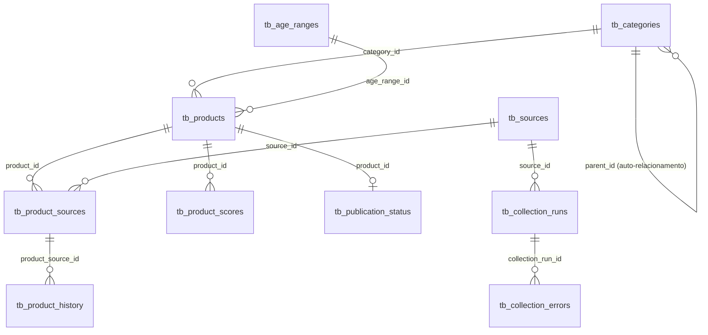

# Banco de Dados

O schema é PostgreSQL puro, modelado com SQLAlchemy 2.0 (estilo
`Mapped`/`mapped_column`) e versionado com Alembic. Todas as tabelas
seguem o prefixo `tb_`. Enums de domínio são armazenados como `VARCHAR`
(`native_enum=False`) em vez de `ENUM` nativo do Postgres, para permitir
adicionar novos valores sem uma migração `ALTER TYPE`.

## Diagrama de relacionamento



## Tabelas

### `tb_categories`
Categorias de produto, com hierarquia opcional (categoria pai/filha).

| Coluna | Tipo | Notas |
|---|---|---|
| id | PK | |
| name | varchar(150) | |
| slug | varchar(150) | único, indexado |
| parent_id | FK → tb_categories.id | `ON DELETE SET NULL`, auto-relacionamento |
| is_active | boolean | padrão `true` |
| created_at / updated_at | timestamptz | `TimestampMixin` |

### `tb_age_ranges`
Faixas etárias (ou gestação) às quais um produto se destina.

| Coluna | Tipo | Notas |
|---|---|---|
| id | PK | |
| code | varchar(30) | único (ex.: `GESTANTE`, `0_A_6_MESES`, `1_A_2_ANOS`) |
| name | varchar(100) | |
| minimum_age_months / maximum_age_months | integer, nullable | |
| is_pregnancy | boolean | padrão `false` |

### `tb_sources`
Fontes externas (API, feed ou página pública) de onde produtos são coletados.

| Coluna | Tipo | Notas |
|---|---|---|
| id | PK | |
| name | varchar(150) | |
| code | varchar(50) | único (ex.: `mock`, `public_open_data`) |
| base_url | varchar(500) | |
| country | varchar(2) | padrão `BR` |
| source_type | enum-as-string | `OFFICIAL_API`, `PUBLIC_FEED`, `PUBLIC_PAGE`, `SIMPLE_HTTP`, `MOCK` |
| is_active | boolean | controla se o `CollectorRegistry` permite coletar |
| requires_authentication | boolean | |
| collection_interval_minutes | integer | padrão 60 |
| terms_url | varchar(500), nullable | |

### `tb_products`
Produto **canônico**, já deduplicado entre fontes.

| Coluna | Tipo | Notas |
|---|---|---|
| id | PK | |
| normalized_name | varchar(300) | indexado |
| brand | varchar(150), nullable | |
| description | text, nullable | |
| category_id | FK → tb_categories.id | `ON DELETE RESTRICT` |
| age_range_id | FK → tb_age_ranges.id, nullable | `ON DELETE SET NULL` |
| canonical_hash | varchar(64) | único, indexado — usado para EXACT_MATCH na deduplicação |
| moderation_status | enum-as-string | `PENDING`, `APPROVED`, `REJECTED`, `ARCHIVED` |
| first_seen_at / last_seen_at | timestamptz | |

### `tb_product_sources`
Ocorrência de um produto canônico em uma fonte específica (um produto
pode ter várias linhas aqui, uma por fonte onde foi visto).

| Coluna | Tipo | Notas |
|---|---|---|
| id | PK | |
| product_id | FK → tb_products.id | `ON DELETE CASCADE` |
| source_id | FK → tb_sources.id | `ON DELETE CASCADE` |
| external_id | varchar(150), nullable | id do produto na fonte original |
| url_hash | varchar(64), nullable | hash da URL normalizada, usado quando não há `external_id` |
| original_name | varchar(300) | nome exatamente como capturado na fonte |
| original_url / affiliate_url / image_url | varchar, nullable | |
| seller_name | varchar(200), nullable | |
| currency | varchar(3) | padrão `BRL` |
| current_price / original_price | numeric(12,2), nullable | nunca `float` |
| rating | numeric(3,2), nullable | 0.00–5.00 |
| review_count / sales_count / ranking_position | integer, nullable | |
| availability | enum-as-string | `AVAILABLE`, `UNAVAILABLE`, `UNKNOWN` |
| collected_at | timestamptz | |

Restrições: `UNIQUE(source_id, external_id)` e um índice único parcial
`UNIQUE(source_id, url_hash) WHERE external_id IS NULL` — garante que a
idempotência funcione tanto por `external_id` quanto por URL quando a
fonte não expõe um identificador estável.

### `tb_product_history`
Snapshot pontual das métricas de um `ProductSource` a cada coleta —
histórico usado para calcular o Trend Score.

| Coluna | Tipo | Notas |
|---|---|---|
| id | PK | |
| product_source_id | FK → tb_product_sources.id | `ON DELETE CASCADE` |
| price / original_price | numeric(12,2), nullable | |
| rating | numeric(3,2), nullable | |
| review_count / sales_count / ranking_position | integer, nullable | |
| availability | enum-as-string | |
| collected_at | timestamptz, indexado | |
| created_at | timestamptz | |

### `tb_product_scores`
Resultado do cálculo de pontuação de um produto em um dado momento
(uma nova linha é criada a cada recálculo — histórico de pontuações
preservado, nunca sobrescrito).

| Coluna | Tipo | Notas |
|---|---|---|
| id | PK | |
| product_id | FK → tb_products.id | `ON DELETE CASCADE` |
| trend_score / social_score / risk_score / opportunity_score | numeric(5,2), nullable | 0.00–100.00 |
| trend_status | enum-as-string | ver [docs/scoring.md](scoring.md) |
| calculation_version | varchar(20) | vem de `scoring_rules.json["version"]` |
| calculation_details | JSONB | detalhes de cada componente do cálculo (auditoria/depuração) |
| calculated_at | timestamptz, indexado | |

### `tb_publication_status`
Controle manual de aprovação/rejeição de um produto para divulgação
(um-para-um com `tb_products`).

| Coluna | Tipo | Notas |
|---|---|---|
| id | PK | |
| product_id | FK → tb_products.id | único, `ON DELETE CASCADE` |
| status | enum-as-string | `PENDING`, `APPROVED`, `REJECTED`, `ARCHIVED` |
| notes | text, nullable | observações do moderador |
| approved_at / rejected_at | timestamptz, nullable | mutuamente exclusivos (ver [architecture.md](architecture.md)) |

### `tb_collection_runs`
Registro de uma execução de coleta para uma fonte específica.

| Coluna | Tipo | Notas |
|---|---|---|
| id | PK | |
| source_id | FK → tb_sources.id | `ON DELETE CASCADE` |
| started_at / finished_at | timestamptz | `finished_at` nulo enquanto `RUNNING` |
| status | enum-as-string | `RUNNING`, `SUCCESS`, `PARTIAL_SUCCESS`, `FAILED` |
| items_found / items_created / items_updated / items_ignored / errors_count | integer | contadores da execução |
| execution_id | UUID | único, gerado automaticamente (ou informado via `--execution-id`) |

### `tb_collection_errors`
Erro individual ocorrido ao processar um item durante uma coleta
(não interrompe a execução inteira).

| Coluna | Tipo | Notas |
|---|---|---|
| id | PK | |
| collection_run_id | FK → tb_collection_runs.id | `ON DELETE CASCADE` |
| error_type | varchar(150) | nome da exceção |
| message | text | |
| traceback | text, nullable | |
| source_url / external_id | varchar, nullable | |
| payload | JSONB, nullable | dados brutos do item que falhou, para depuração |

## Convenções

- Todo valor monetário/percentual usa `Numeric`, nunca `Float`
  (evita erros de arredondamento binário em preços/pontuações).
- Toda coluna de data/hora usa `DateTime(timezone=True)` — o
  aplicativo sempre grava/lê em UTC (`utils/dates.now_utc()`).
- Enums de domínio (`enums/`) são persistidos como string via
  `SAEnum(..., native_enum=False)`, nunca como `ENUM` nativo do
  Postgres, para simplificar futuras adições de valores.

## Migrações (Alembic)

- Configuração em [alembic.ini](../alembic.ini) e `migrations/env.py`
  (a URL do banco é sempre lida de `Settings.database_url` em tempo de
  execução, nunca hardcoded no arquivo de configuração).
- Migração inicial: `migrations/versions/905a06eb0ee4_initial_schema.py`,
  cria as 10 tabelas acima.
- Comandos via CLI (não é necessário instalar/chamar `alembic` diretamente):

```bash
ninho-mimo-trends database check              # testa a conexão
ninho-mimo-trends database upgrade            # aplica até a revisão 'head'
ninho-mimo-trends database upgrade --revision <rev>
ninho-mimo-trends database downgrade --revision <rev>
```

## Banco de testes

A suíte de testes automatizados (`tests/`) usa um banco PostgreSQL
**dedicado e separado** (`ninho_mimo_trends_test`), nunca o banco de
desenvolvimento ou produção. O schema é criado/removido diretamente via
`Base.metadata.create_all()`/`drop_all()` em `tests/conftest.py` (sem
Alembic, por simplicidade/velocidade — as migrações já são validadas
separadamente contra o banco de desenvolvimento). Um fixture de
segurança (`_guard_against_non_test_environment`) aborta a sessão de
testes inteira caso `APP_ENV=PROD` ou o nome do banco configurado não
contenha `"test"`, evitando que a suíte rode acidentalmente (e destrua
dados) em um banco real.
